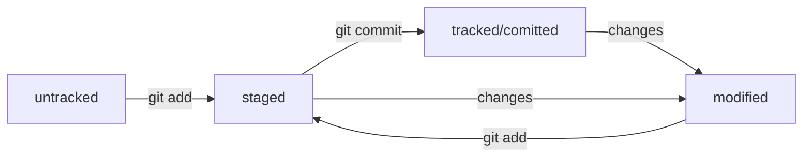

# Шпаргалка по Git

1. Сделать папку репозиторием — перейди в нужную папку и сделай "_git init_"
 - если передумал, то просто убери подкаталог <.git> ( _rm -rf .git_)

2. Проверить состояние репозитория — _git status_
 - ну и сиди, читай

 ... **Добавляем какие-то файлы в репозиторий**
  
 3. Подготовить файлы к сохранению — "_git add filename_" или "_git add ._" (всю текущую папку), или "_git add --all_" (весь репо)

4. Выполнить коммит — _git commit_

- _git commit -m 'Message: My first commit made'_

- и снова читай его сообщения

5. Просмотреть историю коммитов — _git log_

### GitHub — платформа для хранения IT-проектов и совместной работы над ними с использованием Git.

1. Зарегистрироваться.
2. Создать новый репозиторий.
3. Сгенерировать ключи SSH. 
- _ssh-keygen -t ed25519 -C "электронная почта, к которой привязан ваш аккаунт на GitHub"_ 
- или _ssh-keygen -t rsa -b 4096 -C "электронная почта, к которой привязан ваш аккаунт на GitHub"_
- проверить в .ssh/ (_ls -a ~/.ssh_)
- pub - всем, не пуб - только себе
4. Связать SSH-ключ с GitHub-аккаунтом.
- скопируй публичный ключ через буфер обмена - **Add SSH key**
- проверь правильность: _ssh -T git@github.com_
5. Связать локальный и удалённый репозитории.
- перейти в папку репо и ввести
_git remote add origin git@github.com:%ACCOUNT_NAME%/project_name.git_
(git remote add origin git@github.com:hishrau/git-status-lesson.git)
- убедись, что связались: _git remote -v_
6. Отправить изменения на удалённый репозиторий — git push
- _git push -u origin master_

### Файл README.md
_Markdown - см. в отдельном документе или в сети_

# Шпаргалка markdown

## Выделение текста

Вы можете выделять текст в markdown с помощью символов `_` или `*`. Например:

Пример _курсива_ и **жирного** текста.

## Заголовки

Заголовки можно создавать с помощью символа `#`. Чем больше `#`, тем меньше заголовок. Например:

# Заголовок первого уровня
## Заголовок второго уровня
### Заголовок третьего уровня

## Выделение кода

Чтобы выделить текст как код, поместите его в тройные кавычки `````. 

```
mkdir my_project
cd my_project
git init
```
Это лишь некоторые функции markdown.

---
### Хеш — идентификатор коммита
- Git преобразует информацию о коммитах с помощью алгоритма SHA-1 и для каждого из них рассчитывает уникальный идентификатор — хеш.
- Хеш — основной идентификатор коммита и позволяет узнать его автора, дату и содержимое закоммиченных файлов.
- Все хеши, а также таблицу соответствий хеш → информация о коммите Git хранит в папке .git.

### Исследуем лог - _git log_
Получить сокращённый лог — _git log --oneline_

#### Файл HEAD

- В числе прочих файлов в папке .git есть служебный файл HEAD. Он указывает на самый свежий коммит.
- Вместо хеша последнего коммита можно написать слово HEAD — Git вас поймёт.

### Статусы untracked/tracked, staged и modified



### Выполнить unstage изменений файла — _git restore --staged \<file\>_
- _git restore --staged ._ -- unstage the whole folder

### Откатить» коммит — _git reset --hard \<commit hash\>_

- реально удаляет последние коммиты начиная с указанного и возвращает прежнее состояние файлов

### Откатить» изменения, которые не попали ни в staging, ни в коммит — _git restore \<file\>_

- откатит файл до последней версии, сохраненной командами _add_ или _commit_


### Просматриваем изменения в файлах -- _git diff_

- создали и закоммитили файл;
- внесли изменения (ни добавляя, ни делая коммит)
- _git diff_ выведет изменения (красным (-) удалено, зеленым (+) добавлено), указав первую строку с изменениями и количество измененных строк
- если файл уже в staged (после git add), чтобы вывести изменения, нужен параметр: _git diff --staged_


### Сопоставляем коммиты

- изменяем файл и коммитим его после каждого изменения
- _git log --oneline_
- в выводе берем нужные коммиты - их хеши (вместо последнего можно HEAD)
- git diff hash_orig hash_last

#### Порядок аргументов git diff

По сути команда git diff A B выводит список инструкций: как превратить состояние A в состояние B. Если поменять A и B местами (git diff B A), то и инструкции будут обратные: как превратить B в A. При этом все зелёные строки станут красными, и наоборот.


### Игнорирование файлов в Git

Чтобы игнорировать не подлежащие отслеживанию/загрузке файлы и не добавлять их в репозиторий, нужно создать файл \<_.gitignore_\> и записать в него имена соответствующих файлов - по одному на строку или используя шаблоны. 

Файл добавляется в корень папки и коммитится. Это правило распространяется только на новые (untracked) файлы. # - comments.

#### Как заполнить .gitignore

- Комментарий - # ...
- Просто название файла
- Символ звёздочки (*) соответствует любой строке, включая пустую
- Вопросительный знак ? соответствует одному любому символу
- Квадратные скобки соответствуют одному символу из списка, который указан в скобках.
- Косая черта (слеш /), указывает на каталоги. Если шаблон в .gitignore начинается со слеша, то Git проигнорирует файлы или каталоги только в корневой директории. Если шаблон заканчивается слешем, то правило применится только к папке.
- Функция парных звёздочек (**) похожа на функцию одинарной (*). Отличие в том, как они работают с вложенными папками. Двойная звёздочка может соответствовать любому количеству таких папок (в том числе нулю). Одинарная может соответствовать только одной.
- Любое правило в файле .gitignore можно инвертировать с помощью восклицательного знака (!).


```bash
# игнорировать все файлы, которые заканчиваются на .jpeg
*.jpeg

# игнорировать все файлы "tmp" во всех подпапках папки docs
docs/*/tmp

# игнорировать файлы file0.txt, file1.txt и file2.txt
# при этом не игнорировать file3.txt, file4.txt, ...
file[0-2].txt

# игнорировать todo.txt в корне репозитория
/todo.txt

# для сравнения: spam.txt будет игнорироваться во всех папках
spam.txt

# игнорировать папку build
build/ 

# игнорировать файлы "docs/current/tmp", "docs/old/tmp",
# а также "docs/old/saved/a/b/c/d/tmp"
# и даже "docs/tmp", потому что ноль вложенных папок тоже подходит
docs/**/tmp

# игнорировать только "docs/current/tmp" и "docs/old/tmp"
# файл "docs/old/saved/a/b/c/d/tmp" не попадает в правило
docs/*/tmp

# игнорировать все JPEG-файлы
*.jpeg

# но только не мем с Doge
!doge.jpeg

# игнорировать все файлы в каталоге build
build/

# игнорировать все .log файлы
*.log

# не игнорировать *.log файлы в examples
# потому что это пример для документации
!examples/**/*.log

# игнорировать все файлы
**

# кроме .tex и .pdf
!**.tex
!**.pdf
```
Игнорируемые файлы не отображаются в выводе команды git status, иначе они бы засоряли вывод. Если всё же нужно отобразить все игнорируемые файлы, то это можно сделать с помощью ключа --ignored: git status --ignored. В таком случае в выводе git status появится раздел Ignored files.

## Клонирование чужого репозитория
git clone git@github.com:YandexPraktikum/first-project.git (от англ. clone, «клон», «копия») — склонируй репозиторий с URL first-project.git из аккаунта YandexPraktikum на мой локальный компьютер.

## Создание веток
git branch feature/the-finest-branch (от англ. branch, «ветка») — создай ветку от текущей с названием feature/the-finest-branch;

git checkout -b feature/the-finest-branch — создай ветку feature/the-finest-branch и сразу переключись на неё.

## Навигация по веткам
git branch (от англ. branch, «ветка») — покажи, какие есть ветки в репозитории и в какой из них я нахожусь (текущая ветка будет отмечена символом *);

git branch -a — покажи все известные ветки, как локальные (в локальном репозитории), так и удалённые (в origin, или на GitHub).

git checkout feature/br — переключись на ветку feature/br.

## Сравнение веток
git diff main HEAD (от англ. difference, «отличие», «разница») — покажи разницу между веткой main и указателем на HEAD;

git diff HEAD~2 HEAD — покажи разницу между тем коммитом, который был два коммита назад, и текущим.

## Удаление веток
git branch -d br-name — удали ветку br-name, но только если она является частью main;

git branch -D br-name — удали ветку br-name, даже если она не объединена с main.

## Слияние веток
git merge main (от англ. merge, «сливать», «поглощать») — объедини ветку main с текущей активной веткой. 

## Работа с удалённым репозиторием

git push -u origin my-branch (от англ. push, «толкнуть», «протолкнуть») — отправь новую ветку my-branch в удалённый репозиторий и свяжи локальную ветку с удалённой, чтобы при дополнительных коммитах можно было писать просто git push без -u;

git push my-branch — отправь дополнительные изменения в ветку my-branch, которая уже существует в удалённом репозитории;

git pull (от англ. pull, «вытянуть») — подтяни изменения текущей ветки из удалённого репозитория.
