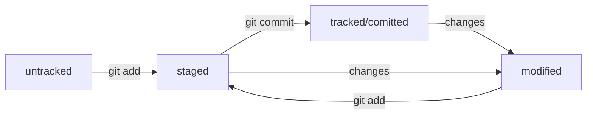

# Шпаргалка по Git

1. Сделать папку репозиторием — перейди в нужную папку и сделай "_git init_"
 - если передумал, то просто убери подкаталог <.git> ( _rm -rf .git_)

2. Проверить состояние репозитория — _git status_
 - ну и сиди, читай

 ... **Добавляем какие-то файлы в репозиторий**
  
 3. Подготовить файлы к сохранению — "_git add filename_" или "_git add ._" (всю текущую папку), или "_git add --all_" (весь репо)

4. Выполнить коммит — _git commit_

- _git commit -m 'Message: My first commit made'_

- и снова читай его сообщения

5. Просмотреть историю коммитов — _git log_

### GitHub — платформа для хранения IT-проектов и совместной работы над ними с использованием Git.

1. Зарегистрироваться.
2. Создать новый репозиторий.
3. Сгенерировать ключи SSH. 
- _ssh-keygen -t ed25519 -C "электронная почта, к которой привязан ваш аккаунт на GitHub"_ 
- или _ssh-keygen -t rsa -b 4096 -C "электронная почта, к которой привязан ваш аккаунт на GitHub"_
- проверить в .ssh/ (_ls -a ~/.ssh_)
- pub - всем, не пуб - только себе
4. Связать SSH-ключ с GitHub-аккаунтом.
- скопируй публичный ключ через буфер обмена - **Add SSH key**
- проверь правильность: _ssh -T git@github.com_
5. Связать локальный и удалённый репозитории.
- перейти в папку репо и ввести
_git remote add origin git@github.com:%ACCOUNT_NAME%/project_name.git_
(git remote add origin git@github.com:hishrau/git-status-lesson.git)
- убедись, что связались: _git remote -v_
6. Отправить изменения на удалённый репозиторий — git push
- _git push -u origin master_

### Файл README.md
_Markdown - см. в отдельном документе или в сети_

# Шпаргалка markdown

## Выделение текста

Вы можете выделять текст в markdown с помощью символов `_` или `*`. Например:

Пример _курсива_ и **жирного** текста.

## Заголовки

Заголовки можно создавать с помощью символа `#`. Чем больше `#`, тем меньше заголовок. Например:

# Заголовок первого уровня
## Заголовок второго уровня
### Заголовок третьего уровня

## Выделение кода

Чтобы выделить текст как код, поместите его в тройные кавычки `````. 

```
mkdir my_project
cd my_project
git init
```
Это лишь некоторые функции markdown.

---
### Хеш — идентификатор коммита
- Git преобразует информацию о коммитах с помощью алгоритма SHA-1 и для каждого из них рассчитывает уникальный идентификатор — хеш.
- Хеш — основной идентификатор коммита и позволяет узнать его автора, дату и содержимое закоммиченных файлов.
- Все хеши, а также таблицу соответствий хеш → информация о коммите Git хранит в папке .git.

### Исследуем лог - _git log_
Получить сокращённый лог — _git log --oneline_

#### Файл HEAD

- В числе прочих файлов в папке .git есть служебный файл HEAD. Он указывает на самый свежий коммит.
- Вместо хеша последнего коммита можно написать слово HEAD — Git вас поймёт.

### Статусы untracked/tracked, staged и modified



### Выполнить unstage изменений файла — _git restore --staged \<file\>_
- _git restore --staged ._ -- unstage the whole folder

### Откатить» коммит — _git reset --hard \<commit hash\>_

- реально удаляет последние коммиты начиная с указанного и возвращает прежнее состояние файлов

### Откатить» изменения, которые не попали ни в staging, ни в коммит — _git restore \<file\>_

- откатит файл до последней версии, сохраненной командами _add_ или _commit_

